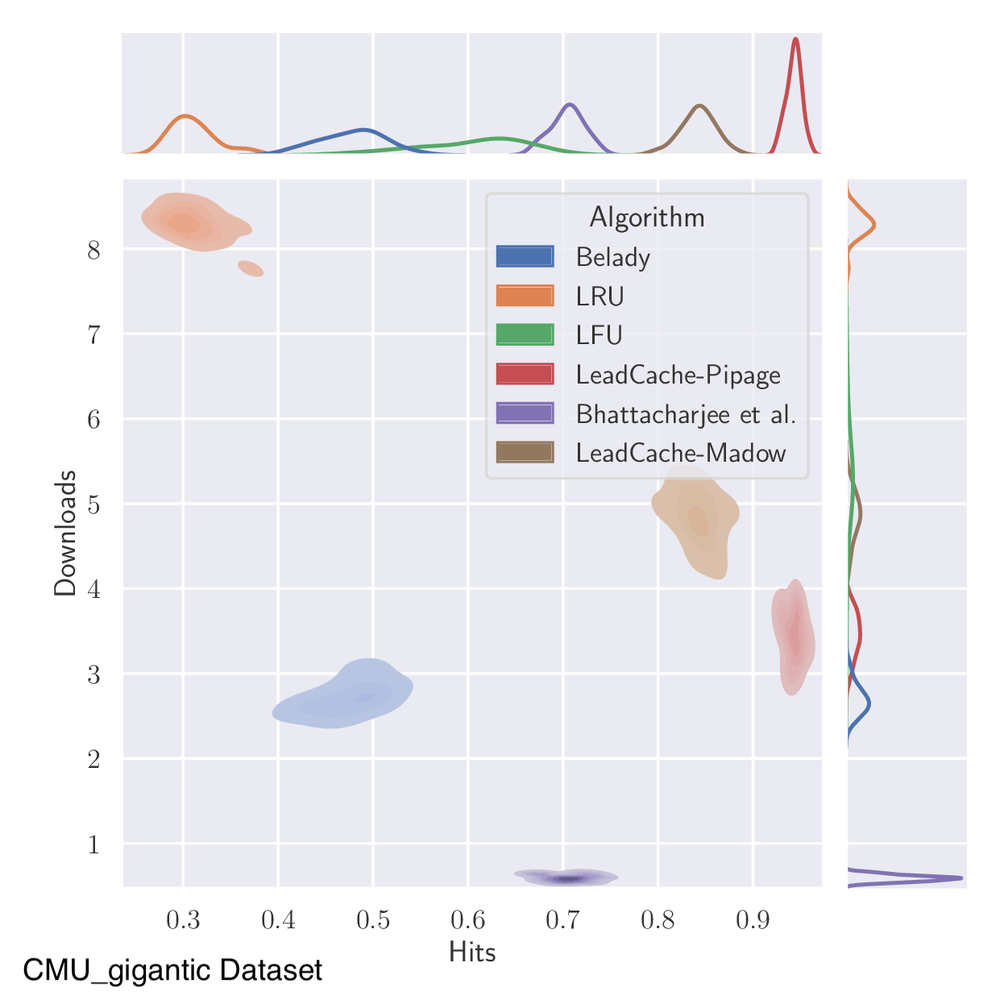
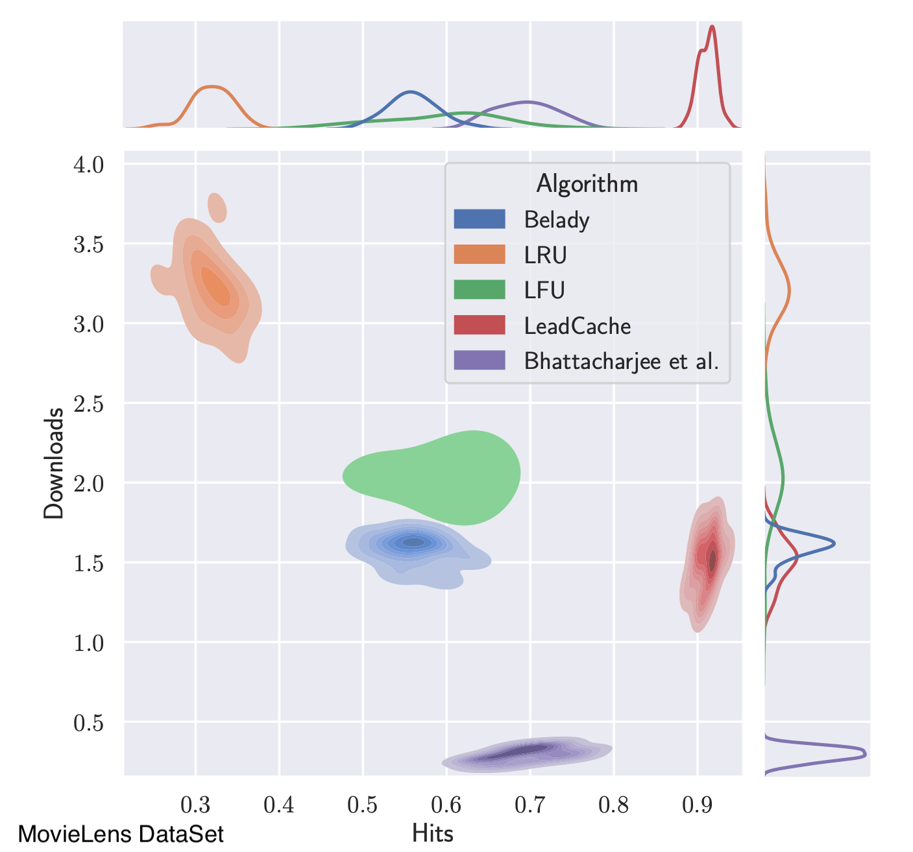

# LeadCache-NeurIPS21 #
Implementation of the LeadCache Algorithm of the NeurIPS 21 paper "LeadCache: Regret-Optimal Caching in Networks"
The arXiv version of the paper is available at: https://arxiv.org/abs/2009.08228

We look at the problem of content distribution in a bipartite network graph from an online learning point of view. Devise theoretically sound algorithms for the problem and show that it outperforms existing algorithms for the bipartite network.

This repository allows us compare hit rates and download rates of policies.

<div align="center">
<figure>
    
</figure>
<figure>
   
</figure>
</div>

## Requirements

- python 3.7.6 
- pandas 1.0.1
- numpy 1.20.3
- scipy 1.6.0
- matplotlib 3.1.3

To install requirements:

```setup
pip install -r requirements.txt
```
the file requirements contains all the list of requirements.

## Dataset

We use a publicly available anonymized production trace from a large CDN provider available under a BSD 2-Clause License [Berger et al., 2018, Berger,
2018]. Traces are expected in the webcachesim space-separated format with three columns (time, id, size in bytes) and a separate request on each line. 
There are two datasets available in this repo 
- CMU_gigantic.txt(CMU_gigantic)
- ratings1m.dat(Movie_lens)


## Usage

```
python driver2.py -users USERS -time_limit TIME_LIMIT -caches CACHES -degree DEGREE -libsize LIBRARY_SIZE -alpha ALPHA -numseq NUMSEQ -dataset DATASET
```

- users: The number of users in the network 
- caches: The number of caches in the network
- time_limit: The number of time steps to run the algorithm on the network
- libsize: library size of the sequences
- alpha: The size of the caching network as percentage of the library size 
- degree: The number of links per cache 
- numseq: The number of non-overlapping sequences over which the experminent runs
- dataset: This takes two values one is CMU_gigantic another is Movie_lens.

As output we get the average hit and download files for each of the algorithms per numseq.

- LeadCache_Pipage
- LeadCache_Madow
- LFU
- LRU
- OPT(Belady)
- Pertubed_LFU(Bhattacharjee et al.)

We also get dynamic hit-rate and download logs files for the last non-overlapping sequences over which the experminent runs. 
Which can be identified by the Seq.csv suffix of the files.
